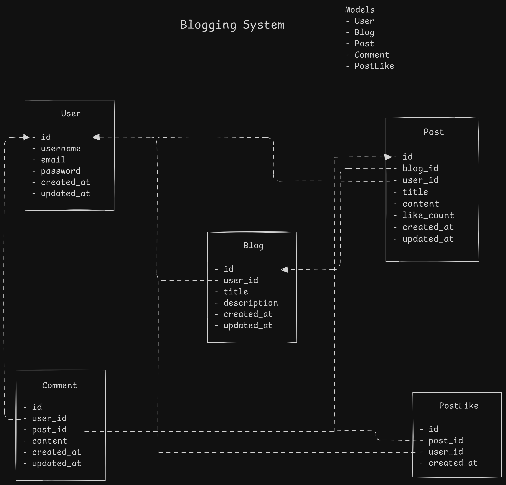
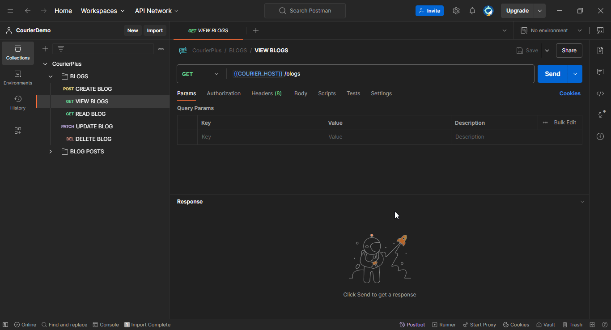
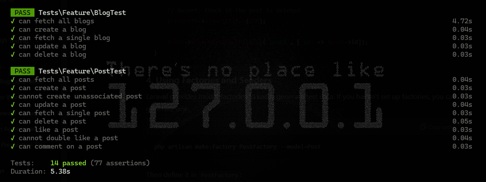

# Courier Blogging System

## Overview

This repo contains a solution to an assessment, i.e to build a blogging system with REST API endpoints for interaction and CRUD functionalities.



## Table of Contents

- [Courier Blogging System](#courier-blogging-system)
  - [Overview](#overview)
  - [Table of Contents](#table-of-contents)
  - [Get started](#get-started)
    - [Requirements](#requirements)
    - [Installation](#installation)
    - [Running the Application](#running-the-application)
  - [Commands](#commands)
    - [Running tests](#running-tests)
    - [Artisan commands](#artisan-commands)
  - [API Endpoints](#api-endpoints)
    - [Blogs](#blogs)
    - [Posts](#posts)

## Get started

### Requirements

You will need the following tools installed on your computer to run the project.

- [PHP](https://www.php.net/downloads) (at least v8.1)
- [Composer](https://getcomposer.org/doc/)
- [Git](https://git-scm.com/downloads) (For source control)
- [SQLite]
- [Postman](https://www.postman.com/) or cURL (For API testing)

### Installation

1. Clone the repo

    ```bash
    git clone https://github.com/Di-void/courierplus-blog-api.git
    cd courierplus-blog-api
    ```

2. Install dependencies

    Run Composer to install the required PHP packages.

    ```bash
    composer install
    ```

3. Environment setup

    Copy the example environment file to your environment file.

    ```bash
    cp .env.example .env
    ```

4. Generate application key

    ```bash
    php artisan key:generate
    ```

5. Database migration and seeding
> [!NOTE]
> This command will seed the database with a test, `authenticated` user that will be used to interact with the various actions in the system.

```bash
php artisan migrate --seed
  ```

### Running the Application

1. Start the development server

    ```bash
    php artisan serve
    ```

    This will start the application on [http://127.0.0.1:8000](http://127.0.0.1:8000)

2. API Testing (with Postman)
    - Import the Postman collection from your Postman app
    
    - Test the endpoints
    

## Commands

### Running tests

To run tests:

```bash
php artisan test
```



### Artisan commands

- List all artisan commands

  ```bash
  php artisan list
  ```

## API Endpoints

(Optional) include a brief list of API routes if needed.

### Blogs

- `GET /api/v1/blogs` - Fetch all blogs
- `POST /api/v1/blogs` - Create a new blog
- `GET /api/v1/blogs/{id}` - Read a blog
- `PATCH /api/v1/blogs/{id}` - Update a blog
- `DELETE /api/v1/blogs/{id}` - Delete a blog

### Posts

- `GET /api/v1/posts` - Fetch all posts
- `POST /api/v1/posts` - Create a new post
- `GET /api/v1/posts/{id}` - Read a post
- `PATCH /api/v1/posts/{id}` - Update a post
- `DELETE /api/v1/posts/{id}` - Delete a post
- `POST /api/v1/posts/{id}/like` - Like a post
- `POST /api/v1/posts/{id}/comment` - Like a post
